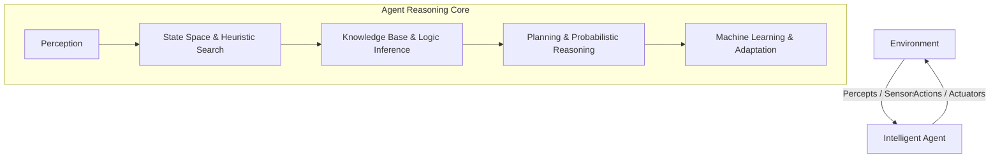

# 🤖 Artificial Intelligence (CS24307) — Complete Syllabus & Study Guide

> **Academic Program:** B.Tech in Computer Science & Engineering  
> **Scheme:** NEP Scheme (2024–25) | BIT Mesra  
> **Semester:** 5th Semester  
> **Theory Course:** `CS24307` — **3.0 Credits**  
> **Lab Course:** `CS24308` — **1.5 Credits**  
> **Total Credits:** **4.5 Credits**

---

## 📌 Table of Contents
1. [Course Overview & Learning Outcomes](#-course-overview--learning-outcomes)
2. [Theory Syllabus: CS24307 (Modules I – V)](#-theory-syllabus-cs24307)
   - [Module I: Introduction & Intelligent Agents](#module-i--introduction--intelligent-agents)
   - [Module II: Problem Solving by Search Agents](#module-ii--problem-solving-by-search-agents)
   - [Module III: Knowledge Representation & Logic Reasoning](#module-iii--knowledge-representation--logic-reasoning)
   - [Module IV: Planning & Probabilistic Reasoning](#module-iv--planning--probabilistic-reasoning)
   - [Module V: Machine Learning Foundations](#module-v--machine-learning-foundations)
3. [Lab Syllabus: CS24308 (Practical AI)](#-lab-syllabus-cs24308)
4. [Standard Reference Books & Recommended Reading](#-recommended-textbooks--references)
5. [Key Exam Topics & High-Yield Questions](#-high-yield-exam-topics--question-bank)
6. [Interactive Study Tracker](#-interactive-study-tracker)

---

## 🎯 Course Overview & Learning Outcomes

Artificial Intelligence focuses on the principles, models, algorithms, and architectures that enable computational systems to perceive their environment, reason about knowledge, solve complex search problems, make optimal decisions under uncertainty, and continuously learn from data.

---

## 📖 Theory Syllabus: CS24307

### Module I – Introduction & Intelligent Agents
*Focus: Definitions of AI, Turing Test, Rationality, PEAS formulation, Environment taxonomies, and Agent architectures.*

- [ ] **Foundations & Evolution of AI:**
  - Definitions of AI (Thinking Humanly, Thinking Rationally, Acting Humanly, Acting Rationally)
  - The Turing Test and Chinese Room Argument
  - Historical milestones (Dartmouth 1956, Expert Systems, AI Winters, Deep Learning revolution)
- [ ] **Intelligent Agents & Rationality:**
  - Agent and Environment interaction loop
  - Rational Action: Definition of Rationality, Omniscience vs. Rationality, Performance measures
  - **PEAS Formulation:** Performance Measure, Environment, Actuators, Sensors (e.g., Automated Taxi Driver, Medical Diagnosis Agent, Vacuum Cleaner)
- [ ] **Nature of Environments:**
  - Fully Observable vs. Partially Observable
  - Single-Agent vs. Multi-Agent (Competitive vs. Cooperative)
  - Deterministic vs. Stochastic
  - Episodic vs. Sequential
  - Static vs. Dynamic vs. Semidynamic
  - Discrete vs. Continuous
  - Known vs. Unknown
- [ ] **Structure of Intelligent Agents:**
  - Simple Reflex Agents (Condition-action rules)
  - Model-Based Reflex Agents (Internal state tracking)
  - Goal-Based Agents (Planning and goal checking)
  - Utility-Based Agents (Trade-off optimization with utility functions)
  - Learning Agents (Critic, Learning element, Performance element, Problem generator)

---

### Module II – Problem Solving by Search Agents
*Focus: State space search formulation, uninformed search, informed heuristic search ($A^*$), local search, and game playing.*

- [ ] **Formulating Search Problems:**
  - Problem formulation components: Initial state $s_0$, Actions $A(s)$, Transition model $\text{Result}(s, a)$, Goal test $G(s)$, Path cost $c(s, a, s')$
  - State space graphs vs. Search trees, Open list (Frontier) and Closed list (Explored set)
- [ ] **Uninformed (Blind) Search Strategies:**
  - **Breadth-First Search (BFS):** FIFO queue, Completeness, Time $O(b^d)$, Space $O(b^d)$, Optimality (for unit step costs)
  - **Depth-First Search (DFS):** LIFO stack, Time $O(b^m)$, Space $O(bm)$, Incompleteness in infinite state spaces
  - **Uniform-Cost Search (UCS / Dijkstra):** Priority queue ordered by path cost $g(n)$, Optimal for general positive costs
  - **Depth-Limited Search (DLS) & Iterative Deepening Search (IDS):** Combining space efficiency of DFS ($O(bd)$) with completeness of BFS
  - **Bidirectional Search:** Searching simultaneously forward from start and backward from goal
- [ ] **Informed (Heuristic) Search Strategies:**
  - Heuristic function $h(n)$ (Estimate of cost from node $n$ to goal)
  - **Greedy Best-First Search:** Evaluates $f(n) = h(n)$
  - **$A^*$ Search Algorithm:** Evaluates $f(n) = g(n) + h(n)$
  - **Admissibility of Heuristics:** $h(n) \le h^*(n)$ (Never overestimates true cost) $\implies$ $A^*$ tree search is optimal
  - **Consistency (Monotonicity):** $h(n) \le c(n, a, n') + h(n') \implies A^*$ graph search is optimal without reopening closed nodes
  - Dominance of heuristics ($h_2(n) \ge h_1(n)$) and effective branching factor
  - Memory-bounded heuristic search: Iterative-Deepening $A^*$ (IDA*), Simplified Memory-Bounded $A^*$ (SMA*)
- [ ] **Local Search & Optimization:**
  - State-space landscape, Global vs. Local optima, Plateaus, Ridges
  - Hill Climbing (Greedy local search), Steepest-ascent, Random restart hill climbing
  - **Simulated Annealing:** Escaping local optima with temperature schedule $T$ and acceptance probability $P = e^{\Delta E / T}$
  - **Genetic Algorithms (GA):** Population, Fitness function, Selection (Roulette wheel, Tournament), Crossover, Mutation
- [ ] **Adversarial Search & Game Playing:**
  - Two-player zero-sum deterministic games (e.g., Chess, Tic-Tac-Toe)
  - **Minimax Algorithm:** Recursive utility propagation across $\text{MAX}$ and $\text{MIN}$ plies
  - **Alpha-Beta Pruning:** Optimal decision making without evaluating irrelevant subtrees ($\alpha$: Best value for MAX, $\beta$: Best value for MIN; Prune when $\alpha \ge \beta$)
  - Evaluation functions and horizon effect

---

### Module III – Knowledge Representation & Logic Reasoning
*Focus: Propositional logic, first-order predicate logic, inference rules, and resolution refutation.*

- [ ] **Knowledge-Based Agents & Wumpus World:**
  - Architecture of Knowledge-Based Agents: Knowledge Base (KB), Tell, Ask
  - The Wumpus World environment: PEAS description, reasoning through exploration
- [ ] **Propositional Logic (PL):**
  - Syntax: Propositional symbols ($P, Q, R$), Connectives ($\neg, \land, \lor, \implies, \iff$)
  - Semantics: Truth tables, Models, Validity (Tautology), Satisfiability (SAT), Unsatisfiability
  - Entailment ($\alpha \models \beta$): $\beta$ is true in all models where $\alpha$ is true
- [ ] **Inference in Propositional Logic:**
  - Inference rules: Modus Ponens, Modus Tollens, And-Elimination, Resolution rule
  - **Resolution Algorithm in PL:** Converting to Conjunctive Normal Form (CNF), Clause resolution, Refutation proof ($\text{KB} \land \neg \alpha \vdash \text{False}$)
  - Forward Chaining & Backward Chaining algorithms for Horn clauses (Linear time complexity $O(n)$)
- [ ] **First-Order Predicate Logic (FOPL / FOL):**
  - Limitations of Propositional Logic (combinatorial explosion, lack of quantification)
  - Syntax of FOL: Constants, Variables, Predicates, Functions, Quantifiers ($\forall, \exists$)
  - Semantics of FOL: Interpretations, Domains, Ground terms, Substitution ($\theta$)
  - Knowledge Engineering in FOL: Translating natural language assertions into FOL
- [ ] **Inference in First-Order Logic:**
  - Universal Instantiation (UI) and Existential Instantiation (EI)
  - **Unification Algorithm:** Most General Unifier (MGU), Occur-check problem
  - **Resolution Refutation in FOL:**
    1. Eliminate biconditionals ($\iff$) and implications ($\implies$)
    2. Move negations inward (De Morgan's laws for quantifiers: $\neg \forall x P \equiv \exists x \neg P$)
    3. Standardize variable names
    4. **Skolemization:** Eliminating existential quantifiers using Skolem constants or Skolem functions
    5. Drop universal quantifiers
    6. Distribute $\lor$ over $\land$ to obtain CNF clauses
    7. Resolve complementary literals using MGU unification until the empty clause ($\square$) is derived.

---

### Module IV – Planning & Probabilistic Reasoning
*Focus: Classical planning representations, goal stack planning, probability axioms, and Bayesian Networks.*

- [ ] **Classical Planning in AI:**
  - State representation, Goal representation, Action representation
  - **STRIPS Representation:** Preconditions, Add list, Delete list
  - **Planning Domain Definition Language (PDDL):** Domains, Problems, Predicates, Action schemas
- [ ] **Planning Algorithms:**
  - Progression (Forward State-Space Search) vs. Regression (Backward Relevant-States Search)
  - **Goal Stack Planning:** Using a stack to hold subgoals and operators, Non-linear planning and the Sussman Anomaly (Blocks World)
  - Planning Graph (Graphplan): Proposition levels, Action levels, Mutual Exclusion (Mutex) relations (Inconsistent effects, Interference, Competing needs)
- [ ] **Reasoning Under Uncertainty:**
  - Limitations of purely logical reasoning in real-world stochastic domains
  - Prior probability, Conditional (Posterior) probability $P(A \mid B) = \frac{P(A \land B)}{P(B)}$
  - Axioms of Probability, Joint Probability Distributions
  - **Bayes' Rule:** $P(Y \mid X) = \frac{P(X \mid Y) P(Y)}{P(X)} = \frac{P(X \mid Y) P(Y)}{\sum_y P(X \mid y) P(y)}$
  - Conditional Independence: $P(X, Y \mid Z) = P(X \mid Z) P(Y \mid Z)$
- [ ] **Bayesian Networks (Belief Networks / Directed Graphical Models):**
  - Network structure: Directed Acyclic Graph (DAG) representing causal relationships
  - Conditional Probability Tables (CPTs)
  - Joint distribution factorization: $P(X_1, X_2, \dots, X_n) = \prod_{i=1}^n P(X_i \mid \text{Parents}(X_i))$
  - D-separation (Direction-dependent separation): Serial connections, Diverging connections, Converging (V-structure / Collider) connections
  - Inference in Bayesian Networks: Exact inference by Enumeration, Variable Elimination; Approximate inference by Monte Carlo Sampling (Rejection Sampling, Likelihood Weighting, Gibbs Sampling)

---

### Module V – Machine Learning Foundations
*Focus: Inductive learning, decision tree induction, formal learning theory, and neural network learning.*

- [ ] **Foundations of Machine Learning:**
  - Supervised vs. Unsupervised vs. Reinforcement Learning paradigms
  - Feedback forms, Inductive bias, Occam's Razor
- [ ] **Decision Tree Induction:**
  - Attribute selection measures: **Entropy** $H(S) = - \sum p_i \log_2(p_i)$
  - **Information Gain:** $\text{Gain}(S, A) = H(S) - \sum_{v \in \text{Values}(A)} \frac{|S_v|}{|S|} H(S_v)$
  - **ID3 Algorithm** and C4.5 algorithm (Gain Ratio, handling continuous attributes)
  - Tree pruning to prevent overfitting (Pre-pruning vs. Post-pruning)
- [ ] **Formal Learning Theory:**
  - Probably Approximately Correct (PAC) Learning model
  - Sample complexity and computational complexity
- [ ] **Artificial Neural Networks (ANN):**
  - Biological neuron vs. Artificial neuron (McCulloch-Pitts model)
  - **Perceptron:** Activation functions (Step, Sigmoid, ReLU), Perceptron Learning Rule, Linear separability limitation (XOR problem)
  - **Multi-Layer Perceptron (MLP):** Hidden layers, Feedforward propagation
  - **Backpropagation Algorithm:** Gradient descent, Chain rule for computing error gradients $\frac{\partial E}{\partial w}$, Learning rate ($\eta$), Momentum
- [ ] **Model Generalization & Regularization:**
  - Underfitting (High Bias) vs. Overfitting (High Variance)
  - Bias-Variance Tradeoff
  - Mitigation techniques: Cross-Validation ($k$-fold), L1/L2 Regularization, Early stopping

---

## 🧪 Lab Syllabus: CS24308

| Lab Module | Core Practical Tasks (Python) |
| :--- | :--- |
| **Lab Module I** | **Agent Modeling & Simulation** • Implement a Table-Driven and Reflex Agent for Vacuum Cleaner World. • Implement a Goal-Based Agent navigating a 2D Grid World with obstacles. • Compare agent behavior in Fully Observable vs. Partially Observable environments. |
| **Lab Module II** | **Search Algorithms & Game AI** • Implement Breadth-First Search (BFS), Depth-First Search (DFS), and Uniform-Cost Search (UCS) in Python. • Implement $A^*$ Search with Euclidean / Manhattan distance heuristics on the 8-Puzzle problem and grid pathfinding. • Build a Tic-Tac-Toe Game AI using the Minimax Algorithm. • Enhance the Minimax engine with Alpha-Beta Pruning. |
| **Lab Module III** | **Knowledge Representation & Logic Solvers** • Implement Propositional Logic Truth Table checker and Horn-clause Forward Chaining engine. • Implement Resolution Refutation algorithm for Propositional Logic in Python. • Implement First-Order Logic Unification algorithm (`unify(expr1, expr2)`). |
| **Lab Module IV** | **Planning & Bayesian Network Inference** • Implement a STRIPS Forward State-Space Planner for the Blocks World problem. • Build a Bayesian Belief Network using `pgmpy` / Python. • Perform exact inference on causal diagnostic networks (e.g., Alarm-Burglary-Earthquake model). |
| **Lab Module V** | **Machine Learning & Neural Network Classifiers** • Implement ID3 Decision Tree algorithm from scratch using Entropy and Information Gain. • Implement a Single-Layer Perceptron and Multi-Layer Perceptron (MLP) with Backpropagation from scratch using NumPy. • Plot Training vs. Validation Loss curves to demonstrate Underfitting and Overfitting. |

---

## 📚 Recommended Textbooks & References

1. **"Artificial Intelligence: A Modern Approach" (AIMA)**  
   *Stuart Russell & Peter Norvig* — Pearson (4th Edition).  
   *(The definitive gold-standard textbook covering all modules).*
2. **"Artificial Intelligence"**  
   *Elaine Rich, Kevin Knight, Shivashankar B. Nair* — McGraw Hill Education (3rd Edition).  
   *(Excellent for search algorithms, heuristic methods, logic representation, and planning).*
3. **"Machine Learning"**  
   *Tom M. Mitchell* — McGraw Hill.  
   *(Foundational text for Decision Trees, PAC learning, and Neural Networks).*

---

## 🌟 High-Yield Exam Topics & Question Bank

### Top Numerical & Algorithmic Problems
1. **$A^*$ Search Trace:** Given a state graph with step costs $g(n)$ and heuristic values $h(n)$, trace the $A^*$ search queue, list the sequence of expanded nodes, and state the final optimal path cost.
2. **Alpha-Beta Pruning:** Given a 3-ply game tree with leaf utility values, trace the Minimax values and identify which subtrees/branches are pruned by Alpha-Beta pruning.
3. **FOL Resolution Refutation:** Translate a set of English statements into First-Order Predicate Logic, convert into Skolemized CNF clauses, and prove a given conclusion using Resolution Refutation.
4. **Bayesian Network Joint Probability:** Given a 4-node Bayesian Network (e.g., Burglary $\rightarrow$ Alarm $\leftarrow$ Earthquake) with CPTs, compute $P(B \mid A)$ and $P(E \mid A, \neg B)$.
5. **Decision Tree Information Gain:** Given a dataset table with attributes (e.g., Outlook, Temperature, Humidity, Wind) and a binary target (Play Tennis), compute the Entropy of the dataset and Information Gain for each attribute to determine the root split.

---

## 📊 Interactive Study Tracker

| Module | Core Concept | Topics Count | Status |
| :---: | :--- | :---: | :---: |
| **M1** | PEAS, Environment Taxonomy, Agent Architectures | 7 | ⬜ Not Started |
| **M2** | BFS/DFS/UCS, $A^*$ Admissibility & Consistency, Minimax, Alpha-Beta | 6 | ⬜ Not Started |
| **M3** | Propositional Logic, Resolution, Horn Clauses, FOL Unification, Skolemization | 9 | ⬜ Not Started |
| **M4** | STRIPS Planning, Goal Stack, Bayes' Rule, Bayesian Network Inference | 7 | ⬜ Not Started |
| **M5** | Decision Tree (Entropy/Gain), PAC Learning, Perceptron, Backpropagation, Bias-Variance | 9 | ⬜ Not Started |
| **LAB** | Vacuum Agent, $A^*$ 8-Puzzle, Tic-Tac-Toe Minimax, Resolution, Bayesian Nets, ID3, MLP | 26 Tasks | ⬜ Not Started |

---
*Created for B.Tech 5th Semester CSE — Artificial Intelligence (`CS24307` & `CS24308`).*
