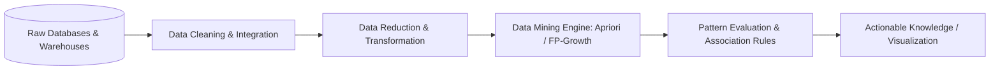

# ⛏️ Data Mining Concepts and Techniques (CS24303) — Complete Syllabus & Study Guide

> **Academic Program:** B.Tech in Computer Science & Engineering  
> **Scheme:** NEP Scheme (2024–25) | BIT Mesra  
> **Semester:** 5th Semester  
> **Course Code:** `CS24303` (Theory) — **3.0 Credits**

---

## 📌 Table of Contents
1. [Course Overview & Learning Outcomes](#-course-overview--learning-outcomes)
2. [Theory Syllabus: CS24303 (Modules I – V)](#-theory-syllabus-cs24303)
   - [Module I: Introduction to Data Mining & Data Attributes](#module-i--introduction-to-data-mining--data-attributes)
   - [Module II: Data Preprocessing](#module-ii--data-preprocessing)
   - [Module III: Data Warehousing & OLAP Technology](#module-iii--data-warehousing--olap-technology)
   - [Module IV: Mining Frequent Patterns & Association Rules](#module-iv--mining-frequent-patterns--association-rules)
   - [Module V: Advanced Pattern Mining & Applications](#module-v--advanced-pattern-mining--applications)
3. [Standard Reference Books & Recommended Reading](#-recommended-textbooks--references)
4. [Key Exam Topics & High-Yield Questions](#-high-yield-exam-topics--question-bank)
5. [Interactive Study Tracker](#-interactive-study-tracker)

---

## 🎯 Course Overview & Learning Outcomes

Data Mining focuses on the automated extraction of implicit, previously unknown, and potentially useful patterns, correlations, and knowledge from massive, heterogeneous datasets. This course covers the end-to-end Knowledge Discovery in Databases (KDD) pipeline spanning data cleaning, data warehousing/OLAP architectures, multidimensional modeling, association analysis, and advanced pattern mining.

---

## 📖 Theory Syllabus: CS24303

### Module I – Introduction to Data Mining & Data Attributes
*Focus: KDD process, data repository architectures, attribute types, statistical summarization, and distance metrics.*

- [ ] **Introduction to Data Mining & KDD:**
  - What is Data Mining? Data mining as an essential step in Knowledge Discovery in Databases (KDD)
  - Data mining vs. Database management (DBMS vs. OLAP vs. Data Mining)
  - **Data Repositories:** Relational Databases, Data Warehouses, Transactional Databases, Advanced Systems (Spatial, Time-Series, Stream, Text, Web databases)
  - **Data Mining Functionalities:** Characterization and Discrimination, Mining Frequent Patterns, Association & Correlation Analysis, Classification, Cluster Analysis, Outlier Detection
  - Classification of Data Mining Systems & Major Challenges (Scalability, High dimensionality, Handling noise)
- [ ] **Data Objects & Attribute Types:**
  - Data objects (tuples/samples) and attributes (features/dimensions)
  - **Attribute Types:** Nominal (Categorical), Binary (Symmetric vs. Asymmetric), Ordinal, Numeric (Interval-Scaled vs. Ratio-Scaled)
- [ ] **Basic Statistical Descriptions of Data:**
  - Measures of Central Tendency: Mean, Trimmed Mean, Median, Mode, Midrange
  - Measures of Dispersion: Range, Quartiles, Interquartile Range (IQR), Five-Number Summary, Boxplots, Variance, Standard Deviation
  - Graphical displays: Histograms, Quantile plots, Quantile-Quantile (Q-Q) plots, Scatter plots
- [ ] **Data Similarity and Dissimilarity Measures:**
  - Proximity matrices (Distance matrix vs. Similarity matrix)
  - Distance metrics for Numeric attributes: **Euclidean Distance** ($L_2$ norm), **Manhattan Distance** ($L_1$ norm), **Minkowski Distance** ($L_p$ norm), Supremum Distance ($L_\infty$)
  - Proximity for Binary attributes: Simple Matching Coefficient (SMC) vs. **Jaccard Coefficient** for asymmetric binary data
  - **Cosine Similarity** for document/sparse vector comparison: $\text{sim}(x, y) = \frac{x \cdot y}{\|x\| \|y\|}$
  - Proximity measures for Nominal, Ordinal, and Mixed attribute types

---

### Module II – Data Preprocessing
*Focus: Data cleaning techniques, correlation analysis, normalization transformations, PCA dimensionality reduction, and discretization.*

- [ ] **Why Preprocess Data?** Data quality dimensions: Accuracy, Completeness, Consistency, Timeliness, Believability, Interpretability
- [ ] **Data Cleaning:**
  - **Handling Missing Values:** Ignore tuple, Manual fill-in, Use global constant, Use attribute mean/median, Use most probable value (regression/decision tree)
  - **Smoothing Noisy Data:** Binning methods (Equal-width vs. Equal-frequency, Smoothing by bin means/medians/boundaries), Regression analysis, Outlier inspection by clustering
- [ ] **Data Integration:**
  - Entity identification problem & schema integration
  - Redundancy and Correlation Analysis:
    - **Chi-Square Test ($\chi^2$)** for nominal attributes: $\chi^2 = \sum \frac{(O - E)^2}{E}$
    - **Correlation Coefficient ($r$) / Pearson's product-moment** for numeric attributes
    - Covariance analysis
- [ ] **Data Transformation:**
  - **Data Normalization:**
    - Min-Max Normalization: $v' = \frac{v - \min_A}{\max_A - \min_A} (new\_\max_A - new\_\min_A) + new\_\min_A$
    - Z-Score Normalization (Zero-mean normalization): $v' = \frac{v - \mu_A}{\sigma_A}$
    - Normalization by Decimal Scaling: $v' = \frac{v}{10^j}$
  - Attribute construction and aggregation
- [ ] **Data Reduction:**
  - **Dimensionality Reduction:** Principal Component Analysis (PCA), Wavelet Transforms, Attribute Subset Selection (Forward selection, Backward elimination)
  - **Numerosity Reduction:** Regression & Log-Linear Models, Histograms, Clustering, Sampling (Simple Random Sampling without replacement, Stratified sampling)
  - Data Compression: Lossless vs. Lossy compression
- [ ] **Data Discretization & Concept Hierarchy Generation:**
  - Discretization by Binning, Histogram analysis, Cluster analysis, Decision tree analysis, Correlation-based discretization ($\chi\text{Merge}$)
  - Concept hierarchies for categorical data (e.g., `Street` $\rightarrow$ `City` $\rightarrow$ `State` $\rightarrow$ `Country`)

---

### Module III – Data Warehousing & OLAP Technology
*Focus: Multidimensional data models, star/snowflake schemas, OLAP operations, and data cube computation.*

- [ ] **Data Warehouse Fundamentals:**
  - Definition (W.H. Inmon): Subject-Oriented, Integrated, Time-Variant, Non-Volatile collection of data in support of management decisions
  - Operational Database Systems (OLTP) vs. Data Warehousing (OLAP) comparison
  - Multi-tier Data Warehouse Architecture: Enterprise Warehouse, Data Marts, Virtual Warehouse
- [ ] **Data Warehouse Modeling: The Multidimensional Data Model:**
  - Dimensions and Fact Tables, Measures (Additive, Semi-Additive, Non-Additive)
  - **Schema Models:**
    - **Star Schema:** Central fact table connected directly to non-normalized dimension tables
    - **Snowflake Schema:** Normalized dimension tables forming hierarchies
    - **Fact Constellation Schema (Galaxy Schema):** Multiple fact tables sharing common dimension tables
- [ ] **Data Cube & OLAP Operations:**
  - Concept of Cuboids (Lattice of cuboids: Base cuboid to Apex cuboid)
  - **OLAP Operations:**
    - **Roll-up (Drill-up):** Climbing up concept hierarchy or reducing dimensions
    - **Drill-down (Roll-down):** Navigating from less detailed data to more detailed data
    - **Slice:** Performing selection on one dimension
    - **Dice:** Defining a sub-cube by selecting on two or more dimensions
    - **Pivot (Rotate):** Rotating axes to provide alternate multidimensional views
- [ ] **Data Warehouse Implementation & Computation:**
  - OLAP Server Architectures: ROLAP (Relational OLAP), MOLAP (Multidimensional OLAP), HOLAP (Hybrid OLAP)
  - **Data Cube Computation:** Multiway Array Aggregation (Full Cube computation), BUC (Bottom-Up Computation), Star-Cubing
  - **Attribute-Oriented Induction (AOI):** Generalization by attribute removal and attribute generalization for concept characterization

---

### Module IV – Mining Frequent Patterns & Association Rules
*Focus: Association rule mining principles, support/confidence framework, Apriori algorithm, and FP-Growth.*

- [ ] **Basic Concepts of Association Rule Mining:**
  - Market Basket Analysis problem formulation
  - Itemsets, $k$-itemsets, Transaction database $D$
  - **Support of an itemset ($A$):** $\text{supp}(A) = \frac{\text{count}(A)}{|D|}$
  - **Association Rule:** $A \implies B$ (where $A, B \subset I$ and $A \cap B = \emptyset$)
  - **Rule Support:** $\text{supp}(A \implies B) = P(A \cup B)$
  - **Rule Confidence:** $\text{conf}(A \implies B) = P(B \mid A) = \frac{\text{supp}(A \cup B)}{\text{supp}(A)}$
  - Strong association rules (satisfying minimum support `min_sup` and minimum confidence `min_conf`)
- [ ] **The Apriori Algorithm (Level-Wise Search):**
  - **The Apriori Property (Downward Closure Property):** All non-empty subsets of a frequent itemset must also be frequent. If an itemset is infrequent, all its supersets are infrequent.
  - Two-Step Candidate Generation:
    1. **Join Step ($L_{k-1} \Join L_{k-1}$):** Join itemsets that share the first $k-2$ items to produce candidate $k$-itemset $C_k$.
    2. **Prune Step:** Drop any candidate in $C_k$ whose $(k-1)$-subset is not in $L_{k-1}$.
  - Generating Association Rules from Frequent Itemsets
- [ ] **Improving Apriori Efficiency:**
  - Hash-based itemset counting (Direct Hashing and Pruning - DHP)
  - Transaction reduction (dropping transactions that contain no frequent items)
  - Partitioning (an itemset frequent in $D$ must be frequent in at least one partition)
  - Dynamic Itemset Counting (DIC)
- [ ] **The FP-Growth Algorithm (Mining Without Candidate Generation):**
  - Limitations of Apriori (multiple database scans, huge candidate sets)
  - **Frequent Pattern Tree (FP-Tree) Construction:** Header table, item ordering by descending support, prefix tree structure
  - **Mining FP-Tree:** Constructing Conditional Pattern Bases and Conditional FP-Trees recursively
- [ ] **Interestingness Evaluation of Association Patterns:**
  - Limitations of the Support-Confidence framework
  - **Correlation Measures:** **Lift** $\text{Lift}(A, B) = \frac{P(A \cup B)}{P(A) P(B)}$, Chi-Square ($\chi^2$), Max-Confidence, Kulczynski (Kulc), Imbalance Ratio (IR)

---

### Module V – Advanced Pattern Mining & Applications
*Focus: Multilevel and multidimensional patterns, constraint-based mining, and high-dimensional pattern mining.*

- [ ] **Multilevel Association Rule Mining:**
  - Mining across concept hierarchies (e.g., `Computer` vs. `Laptop`)
  - Redundant rule filtering using ancestor-descendant relationships
- [ ] **Multidimensional & Quantitative Association Rules:**
  - Interdimension rules vs. Hybrid association rules
  - Discretization of quantitative attributes (Static vs. Dynamic discretization)
- [ ] **Constraint-Based Frequent Pattern Mining:**
  - Knowledge type constraints, Data constraints, Dimension constraints, Rule constraints, Interestingness constraints
  - Constraint properties: **Antimonotonicity**, **Monotonicity**, **Succinctness**, **Convertibility**
  - Pushing constraints deeply into Apriori and FP-Growth mining loops
- [ ] **Mining Complex & High-Dimensional Patterns:**
  - Mining Negative and Rare Patterns
  - Mining Compressed and Colossal Patterns
  - Mining Approximate Frequent Itemsets
- [ ] **Real-World Applications:**
  - Retail market basket analysis & cross-selling
  - Web log usage mining (Clickstream analysis)
  - Fraud detection, Financial market forecasting, and Bioinformatics sequence analysis

---

## 📚 Recommended Textbooks & References

1. **"Data Mining: Concepts and Techniques"**  
   *Jiawei Han, Micheline Kamber, Jian Pei* — Morgan Kaufmann / Elsevier (3rd Edition).  
   *(The primary textbook covering all theoretical and algorithmic aspects from Preprocessing to Pattern Mining).*
2. **"Introduction to Data Mining"**  
   *Pang-Ning Tan, Michael Steinbach, Anuj Karpatne, Vipin Kumar* — Pearson (2nd Edition).  
   *(Excellent reference for distance measures, Apriori property proofs, and FP-Growth).*
3. **"Data Mining Techniques"**  
   *Arun K. Pujari* — Universities Press.  
   *(Great supplementary text for concise exam preparation).*

---

## 🌟 High-Yield Exam Topics & Question Bank

### Top Numerical & Algorithmic Problems
1. **Normalization Calculations:** Given an attribute values range (e.g., Age $[18, 70]$), calculate Min-Max normalization to $[0, 1]$ and Z-Score normalization for a given sample value $v = 35$ with $\mu = 40, \sigma = 12$.
2. **Distance & Proximity Matrices:** Compute Euclidean distance, Manhattan distance, and Cosine similarity for given 3-dimensional data points.
3. **Chi-Square ($\chi^2$) Correlation:** Given a $2 \times 2$ contingency table for attributes (e.g., `Gender` vs. `Preferred Brand`), calculate the expected frequencies and test for independence at $\alpha = 0.05$.
4. **Apriori Algorithm Execution:** Given a transaction database of 9 transactions, trace step-by-step candidate generation ($C_k$), join, prune, and frequent itemset ($L_k$) generation for $\text{min\_sup} = 2$. Derive all strong association rules for $\text{min\_conf} = 70\%$.
5. **FP-Tree Construction & Mining:** Construct the complete FP-Tree for a given transaction database and trace the conditional pattern base and conditional FP-Tree for the least frequent item.

---

## 📊 Interactive Study Tracker

| Module | Core Concept | Topics Count | Status |
| :---: | :--- | :---: | :---: |
| **M1** | KDD Process, Data Objects, Statistical Summaries, Distance & Similarity Metrics | 14 | ⬜ Not Started |
| **M2** | Data Cleaning, $\chi^2$ Correlation, Min-Max & Z-Score Normalization, PCA, Discretization | 6 | ⬜ Not Started |
| **M3** | OLTP vs OLAP, Star/Snowflake Schemas, Data Cube, Roll-up/Drill-down/Slice/Dice, AOI | 9 | ⬜ Not Started |
| **M4** | Support/Confidence, Apriori (Join & Prune), FP-Tree & FP-Growth, Lift & Kulc | 7 | ⬜ Not Started |
| **M5** | Multilevel/Multidimensional Rules, Antimonotonic Constraints, Colossal Patterns | 10 | ⬜ Not Started |

---
*Created for B.Tech 5th Semester CSE — Data Mining Concepts and Techniques (`CS24303`).*
