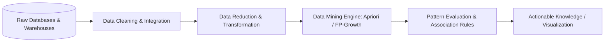

# ⛏️ Data Mining Concepts and Techniques (CS24303) — Complete Syllabus & Study Guide

> **Academic Program:** B.Tech in Computer Science & Engineering  
> **Scheme:** NEP Scheme (2024–25) | BIT Mesra  
> **Semester:** 5th Semester  
> **Course Code:** `CS24303` (Theory) — **3.0 Credits**  
> 🌐 **Live Web Portal:** [https://sh20raj.github.io/study/](https://sh20raj.github.io/study/)  
> 📄 **10-Page Master Quick Revision PDF:** [`pdf/Data_Mining_10_Page_Master_Revision.pdf`](pdf/Data_Mining_10_Page_Master_Revision.pdf)  
> 📚 **Full Course Master Book (~40 Pages):** [`pdf/Data_Mining_Full_Course_Master.pdf`](pdf/Data_Mining_Full_Course_Master.pdf)

---

## 📌 Table of Contents
1. [Course Overview & Learning Outcomes](#-course-overview--learning-outcomes)
2. [Theory Syllabus: CS24303 (Modules I – V)](#-theory-syllabus-cs24303)
   - [Module I: Introduction to Data Mining & Data Attributes](#module-i--introduction-to-data-mining--data-attributes)
   - [Module II: Data Preprocessing](#module-ii--data-preprocessing)
   - [Module III: Data Warehousing & OLAP Technology](#module-iii--data-warehousing--olap-technology)
   - [Module IV: Mining Frequent Patterns & Association Rules](#module-iv--mining-frequent-patterns--association-rules)
   - [Module V: Advanced Pattern Mining & Applications](#module-v--advanced-pattern-mining--applications)
3. [Standard Reference Books & Recommended Reading](#-recommended-textbooks--references)
4. [Key Exam Topics & High-Yield Questions](#-high-yield-exam-topics--question-bank)
5. [Interactive Study Tracker](#-interactive-study-tracker)

---

## 🎯 Course Overview & Learning Outcomes

Data Mining focuses on the automated extraction of implicit, previously unknown, and potentially useful patterns, correlations, and knowledge from massive, heterogeneous datasets. This course covers the end-to-end Knowledge Discovery in Databases (KDD) pipeline spanning data cleaning, data warehousing/OLAP architectures, multidimensional modeling, association analysis, and advanced pattern mining.

---

## 📖 Theory Syllabus: CS24303

### Module I – Introduction to Data Mining & Data Attributes (14 Topics | 11 Pages)
*Focus: KDD process, data repository architectures, attribute types, statistical summarization, and distance metrics.*  
*📄 Module PDF:* [`pdf/Module_1_Data_Attributes_Notes.pdf`](pdf/Module_1_Data_Attributes_Notes.pdf)

- [x] **Introduction to Data Mining & KDD:**
  - What is Data Mining? Data mining as an essential step in Knowledge Discovery in Databases (KDD)
  - Data mining vs. Database management (DBMS vs. OLAP vs. Data Mining)
  - **Data Repositories:** Relational Databases, Data Warehouses, Transactional Databases, Advanced Systems (Spatial, Time-Series, Stream, Text, Web databases)
  - **Data Mining Functionalities:** Characterization and Discrimination, Mining Frequent Patterns, Association & Correlation Analysis, Classification, Cluster Analysis, Outlier Detection
  - Classification of Data Mining Systems & Major Challenges (Scalability, High dimensionality, Handling noise)
- [x] **Data Objects & Attribute Types:**
  - Data objects (tuples/samples) and attributes (features/dimensions)
  - **Attribute Types:** Nominal (Categorical), Binary (Symmetric vs. Asymmetric), Ordinal, Numeric (Interval-Scaled vs. Ratio-Scaled)
- [x] **Basic Statistical Descriptions of Data:**
  - Measures of Central Tendency: Mean, Trimmed Mean, Median, Mode, Midrange
  - Measures of Dispersion: Range, Quartiles, Interquartile Range (IQR), Five-Number Summary, Boxplots, Variance, Standard Deviation
  - Graphical displays: Histograms, Quantile plots, Quantile-Quantile (Q-Q) plots, Scatter plots
- [x] **Data Similarity and Dissimilarity Measures:**
  - Proximity matrices (Distance matrix vs. Similarity matrix)
  - Distance metrics for Numeric attributes: **Euclidean Distance** ($L_2$ norm), **Manhattan Distance** ($L_1$ norm), **Minkowski Distance** ($L_p$ norm), Supremum Distance ($L_\infty$)
  - Proximity for Binary attributes: Simple Matching Coefficient (SMC) vs. **Jaccard Coefficient** for asymmetric binary data
  - **Cosine Similarity** for document/sparse vector comparison: $\text{sim}(x, y) = \frac{x \cdot y}{\|x\| \|y\|}$
  - Proximity measures for Nominal, Ordinal, and Mixed attribute types

---

### Module II – Data Preprocessing (6 Topics | 9 Pages)
*Focus: Data cleaning techniques, correlation analysis, normalization transformations, PCA dimensionality reduction, and discretization.*  
*📄 Module PDF:* [`pdf/Module_2_Preprocessing_Notes.pdf`](pdf/Module_2_Preprocessing_Notes.pdf)

- [x] **Why Preprocess Data?** Data quality dimensions: Accuracy, Completeness, Consistency, Timeliness, Believability, Interpretability
- [x] **Data Cleaning:**
  - **Handling Missing Values:** Ignore tuple, Manual fill-in, Use global constant, Use attribute mean/median, Use most probable value (regression/decision tree, KNN, MICE)
  - **Smoothing Noisy Data:** Binning methods (Equal-width vs. Equal-frequency, Smoothing by bin means/medians/boundaries), Regression analysis, Outlier inspection by clustering & LOF
- [x] **Data Integration:**
  - Entity identification problem & schema integration
  - Redundancy and Correlation Analysis:
    - **Chi-Square Test ($\chi^2$)** for nominal attributes: $\chi^2 = \sum \frac{(O - E)^2}{E}$
    - **Correlation Coefficient ($r$) / Pearson's product-moment** & **Spearman's Rank Correlation ($\rho$)**
    - Covariance analysis
- [x] **Data Transformation:**
  - **Data Normalization:**
    - Min-Max Normalization: $v' = \frac{v - \min_A}{\max_A - \min_A} (new\_\max_A - new\_\min_A) + new\_\min_A$
    - Z-Score Normalization (Zero-mean normalization): $v' = \frac{v - \mu_A}{\sigma_A}$
    - Normalization by Decimal Scaling: $v' = \frac{v}{10^j}$
    - Box-Cox Power Transform & Logarithmic scaling
  - Attribute construction and aggregation
- [x] **Data Reduction:**
  - **Dimensionality Reduction:** Principal Component Analysis (PCA full matrix derivation), Discrete Wavelet Transforms (DWT Haar), Attribute Subset Selection (Forward selection, Backward elimination)
  - **Numerosity Reduction:** Regression & Log-Linear Models, Histograms, Clustering, Sampling (Simple Random Sampling without replacement, Stratified sampling)
  - Data Compression: Lossless vs. Lossy compression
- [x] **Data Discretization & Concept Hierarchy Generation:**
  - Discretization by Binning, Histogram analysis, Cluster analysis, Decision tree analysis, Correlation-based discretization ($\chi\text{Merge}$ step-by-step trace)
  - Concept hierarchies for categorical and numeric data (3-4-5 Rule)

---

### Module III – Data Warehousing & OLAP Technology (9 Topics | 8 Pages)
*Focus: Multidimensional data models, star/snowflake schemas, OLAP operations, and data cube computation.*  
*📄 Module PDF:* [`pdf/Module_3_Data_Warehouse_Notes.pdf`](pdf/Module_3_Data_Warehouse_Notes.pdf)

- [x] **Data Warehouse Fundamentals:**
  - Definition (W.H. Inmon): Subject-Oriented, Integrated, Time-Variant, Non-Volatile collection of data in support of management decisions
  - Operational Database Systems (OLTP) vs. Data Warehousing (OLAP) 10-point comparison
  - Multi-tier Data Warehouse Architecture: Enterprise Warehouse, Data Marts, Virtual Warehouse
- [x] **Data Warehouse Modeling: The Multidimensional Data Model:**
  - Dimensions and Fact Tables, Measures (Additive, Semi-Additive, Non-Additive)
  - **Schema Models with SQL DDL:**
    - **Star Schema:** Central fact table connected directly to non-normalized dimension tables
    - **Snowflake Schema:** Normalized dimension tables forming hierarchies
    - **Fact Constellation Schema (Galaxy Schema):** Multiple fact tables sharing common dimension tables
- [x] **Data Cube & OLAP Operations:**
  - Concept of Cuboids (Lattice of cuboids: Base cuboid to Apex cuboid, $2^n$ cuboid derivation)
  - **5 OLAP Operations:**
    - **Roll-up (Drill-up):** Climbing up concept hierarchy or reducing dimensions
    - **Drill-down (Roll-down):** Navigating from less detailed data to more detailed data
    - **Slice:** Performing selection on one dimension
    - **Dice:** Defining a sub-cube by selecting on two or more dimensions
    - **Pivot (Rotate):** Rotating axes to provide alternate multidimensional views
- [x] **Data Warehouse Implementation & Computation:**
  - OLAP Server Architectures: ROLAP (Relational OLAP), MOLAP (Multidimensional OLAP), HOLAP (Hybrid OLAP)
  - Indexing OLAP data: Bitmap Indexing, Join Indexing, Bitmapped Join Indexing
  - **Data Cube Computation:** Multiway Array Aggregation (Full Cube computation), BUC (Bottom-Up Computation with Iceberg pruning), Star-Cubing
  - **Attribute-Oriented Induction (AOI):** Generalization by attribute removal and attribute generalization for concept characterization

---

### Module IV – Mining Frequent Patterns & Association Rules (7 Topics | 8 Pages)
*Focus: Association rule mining principles, support/confidence framework, Apriori algorithm, and FP-Growth.*  
*📄 Module PDF:* [`pdf/Module_4_Pattern_Mining_Notes.pdf`](pdf/Module_4_Pattern_Mining_Notes.pdf)

- [x] **Basic Concepts of Association Rule Mining:**
  - Market Basket Analysis problem formulation
  - Itemsets, $k$-itemsets, Transaction database $D$
  - **Support of an itemset ($A$):** $\text{supp}(A) = \frac{\text{count}(A)}{|D|}$
  - **Association Rule:** $A \implies B$ (where $A, B \subset I$ and $A \cap B = \emptyset$)
  - **Rule Support:** $\text{supp}(A \implies B) = P(A \cup B)$
  - **Rule Confidence:** $\text{conf}(A \implies B) = P(B \mid A) = \frac{\text{supp}(A \cup B)}{\text{supp}(A)}$
  - Strong association rules (satisfying minimum support `min_sup` and minimum confidence `min_conf`)
- [x] **The Apriori Algorithm (Level-Wise Search):**
  - **The Apriori Property (Downward Closure Property):** Formal mathematical proof & pruning rule
  - Complete 9-transaction execution trace showing $C_1, L_1, C_2, L_2, C_3, L_3$
  - Generating Association Rules from Frequent Itemsets with support, confidence, and lift
- [x] **Improving Apriori Efficiency:**
  - Hash-based itemset counting (Direct Hashing and Pruning - DHP)
  - Transaction reduction (dropping transactions that contain no frequent items)
  - Partitioning (an itemset frequent in $D$ must be frequent in at least one partition)
  - Dynamic Itemset Counting (DIC)
- [x] **Vertical Data Format (ECLAT Algorithm):**
  - Mining frequent itemsets using TID-lists and set intersections
- [x] **The FP-Growth Algorithm (Mining Without Candidate Generation):**
  - Compact Frequent Pattern Tree (FP-Tree) Construction step-by-step
  - Mining FP-Tree: Conditional Pattern Bases and Conditional FP-Trees for all items
- [x] **Interestingness Evaluation of Association Patterns:**
  - Limitations of the Support-Confidence framework
  - **Correlation Measures:** **Lift**, Chi-Square ($\chi^2$), Max-Confidence, Kulczynski (Kulc), Imbalance Ratio (IR), Cosine metric

---

### Module V – Advanced Pattern Mining & Applications (10 Topics | 7 Pages)
*Focus: Multilevel and multidimensional patterns, constraint-based mining, and high-dimensional pattern mining.*  
*📄 Module PDF:* [`pdf/Module_5_Advanced_Mining_Notes.pdf`](pdf/Module_5_Advanced_Mining_Notes.pdf)

- [x] **Multilevel Association Rule Mining:**
  - Mining across concept hierarchies (e.g., `Computer` vs. `Laptop`)
  - Uniform support vs. Reduced (progressive) support strategies
  - Redundant rule filtering using ancestor-descendant relationships
- [x] **Multidimensional & Quantitative Association Rules:**
  - Interdimension rules vs. Hybrid association rules
  - Discretization of quantitative attributes (Static binning vs. Dynamic grid-based clustering)
- [x] **Constraint-Based Frequent Pattern Mining:**
  - 5 Constraint Categories: Knowledge type, Data, Dimension, Rule, Interestingness
  - Constraint properties & formal proofs: **Antimonotonicity**, **Monotonicity**, **Succinctness**, **Convertibility**
  - Pushing constraints deeply into Apriori and FP-Growth mining loops
- [x] **Mining Complex & High-Dimensional Patterns:**
  - Mining Colossal Patterns via **Pattern-Fusion** (core patterns & jumping across search space)
  - Compressed representations: **Closed Frequent Itemsets** (lossless) vs. **Maximal Frequent Itemsets** (lossy)
  - Mining Approximate and Noisy Frequent Itemsets
- [x] **Sequential & Graph Pattern Mining:**
  - Sequential Pattern Mining: Generalized Sequential Patterns (GSP) vs. **PrefixSpan** (prefix-projected pattern growth)
  - Graph Pattern Mining: **gSpan** (canonical DFS code dictionary)
- [x] **Real-World Applications:**
  - Retail market basket analysis & cross-selling
  - Web log usage mining (Clickstream analysis)
  - Healthcare & Bioinformatics (Gene expression co-occurrence, drug interactions)
  - Software Engineering & Bug Localization (Execution trace mining)
  - Financial Fraud Detection

---

## 📚 Recommended Textbooks & References

1. **"Data Mining: Concepts and Techniques"**  
   *Jiawei Han, Micheline Kamber, Jian Pei* — Morgan Kaufmann / Elsevier (3rd Edition).  
   *(The primary textbook covering all theoretical and algorithmic aspects from Preprocessing to Pattern Mining).*
2. **"Introduction to Data Mining"**  
   *Pang-Ning Tan, Michael Steinbach, Anuj Karpatne, Vipin Kumar* — Pearson (2nd Edition).  
   *(Excellent reference for distance measures, Apriori property proofs, and FP-Growth).*
3. **"Data Mining Techniques"**  
   *Arun K. Pujari* — Universities Press.  
   *(Great supplementary text for concise exam preparation).*

---

## 📊 Interactive Study Tracker

| Module | Core Concept | Topics Count | Status | Notes PDF |
| :---: | :--- | :---: | :---: | :---: |
| **M1** | KDD Process, Data Objects, Statistical Summaries, Distance & Similarity Metrics | 14 | ✅ **Completed (14/14)** | [11-Page PDF](pdf/Module_1_Data_Attributes_Notes.pdf) |
| **M2** | Data Cleaning, $\chi^2$ Correlation, Min-Max & Z-Score Normalization, PCA, Discretization | 6 | ✅ **Completed (6/6)** | [9-Page PDF](pdf/Module_2_Preprocessing_Notes.pdf) |
| **M3** | OLTP vs OLAP, Star/Snowflake Schemas, Data Cube, Roll-up/Drill-down/Slice/Dice, AOI | 9 | ✅ **Completed (9/9)** | [8-Page PDF](pdf/Module_3_Data_Warehouse_Notes.pdf) |
| **M4** | Support/Confidence, Apriori (Join & Prune), FP-Tree & FP-Growth, Lift & Kulc | 7 | ✅ **Completed (7/7)** | [8-Page PDF](pdf/Module_4_Pattern_Mining_Notes.pdf) |
| **M5** | Multilevel/Multidimensional Rules, Antimonotonic Constraints, Colossal Patterns | 10 | ✅ **Completed (10/10)** | [7-Page PDF](pdf/Module_5_Advanced_Mining_Notes.pdf) |
| **ALL** | **Complete Data Mining Syllabus** | **46** | 💯 **100% Complete (46/46)** | [Full Master Book](pdf/Data_Mining_Full_Course_Master.pdf) |

---
*Created for B.Tech 5th Semester CSE — Data Mining Concepts and Techniques (`CS24303`).*
