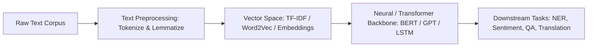

# 🗣️ Natural Language Processing (CS24351) — Complete Syllabus & Study Guide

> **Academic Program:** B.Tech in Computer Science & Engineering  
> **Scheme:** NEP Scheme (2024–25) | BIT Mesra  
> **Semester:** 5th Semester  
> **Program Elective – I:** `CS24351` — **3.0 Credits**

---

## 📌 Table of Contents
1. [Course Overview & Learning Outcomes](#-course-overview--learning-outcomes)
2. [Theory Syllabus: CS24351 (Modules I – V)](#-theory-syllabus-cs24351)
   - [Module I: Introduction to NLP & Text Preprocessing](#module-i--introduction-to-nlp--text-preprocessing)
   - [Module II: Syntax Analysis, Parsing & Language Models](#module-ii--syntax-analysis-parsing--language-models)
   - [Module III: Semantics, Lexical Resources & Word Embeddings](#module-iii--semantics-lexical-resources--word-embeddings)
   - [Module IV: Neural Approaches, Transformers & Pretrained LLMs](#module-iv--neural-approaches-transformers--pretrained-llms)
   - [Module V: NLP Applications & Ethics](#module-v--nlp-applications--ethics)
3. [Standard Reference Books & Recommended Reading](#-recommended-textbooks--references)
4. [Key Exam Topics & High-Yield Questions](#-high-yield-exam-topics--question-bank)
5. [Interactive Study Tracker](#-interactive-study-tracker)

---

## 🎯 Course Overview & Learning Outcomes

Natural Language Processing (NLP) bridges the gap between human communication and computational understanding. This course explores linguistic principles, statistical language modeling, formal syntactic parsing, distributed vector space representations (Word2Vec, GloVe), deep neural sequence models (RNN/LSTM), attention-based Transformer architectures (BERT, GPT), and real-world applied NLP systems.

---

## 📖 Theory Syllabus: CS24351

### Module I – Introduction to NLP & Text Preprocessing
*Focus: Linguistic foundations, preprocessing pipeline, regular expressions, and language models overview.*

- [ ] **Introduction to Natural Language Processing:**
  - What is NLP? Interdisciplinary intersection of Computer Science, AI, and Linguistics
  - Ambiguity in Natural Language: Lexical ambiguity, Syntactic ambiguity, Semantic ambiguity, Pragmatic ambiguity
  - **Linguistic Levels of Analysis:**
    1. **Phonetics & Phonology:** Sound structures
    2. **Morphology:** Word formation and inflection (morphemes, affixes, roots)
    3. **Syntax:** Grammatical phrase structure and word order
    4. **Semantics:** Literal meaning of words and sentences
    5. **Pragmatics & Discourse:** Contextual meaning, speaker intent, reference resolution
- [ ] **Text Preprocessing Pipeline:**
  - **Tokenization:** Word tokenization, Sentence segmentation, Subword tokenization (Byte-Pair Encoding - BPE, WordPiece)
  - **Normalization:** Case folding, Unicode normalization, handling contractions
  - **Stemming vs. Lemmatization:** Porter Stemmer algorithm vs. Dictionary-based Lemmatization (WordNet Lemmatizer)
  - **Stop-Word Removal:** Rationale, domain-specific stop-word lists
- [ ] **Regular Expressions (Regex) for NLP:**
  - Pattern matching syntax, character classes, quantifiers, lookahead and lookbehind assertions
  - Practical NLP extraction tasks: Email, Phone numbers, Currency, Hashtags, URLs
- [ ] **Language Models Overview:**
  - Generative vs. Discriminative models, Assigning probabilities to word sequences $P(w_1, w_2, \dots, w_n)$

---

### Module II – Syntax Analysis, Parsing & Language Models
*Focus: N-gram models, statistical smoothing, POS tagging, Context-Free Grammars, and dependency parsing.*

- [ ] **$N$-gram Language Models:**
  - Chain rule of probability: $P(w_1^n) = \prod_{k=1}^n P(w_k \mid w_1^{k-1})$
  - Markov Assumption: Unigram, Bigram $P(w_n \mid w_{n-1})$, Trigram $P(w_n \mid w_{n-2}, w_{n-1})$ models
  - Maximum Likelihood Estimation (MLE) of $N$-gram probabilities
  - Model Evaluation: **Perplexity** $\text{PP}(W) = P(w_1, w_2, \dots, w_N)^{-1/N} = 2^{-\frac{1}{N} \log_2 P(W)}$
- [ ] **Smoothing Techniques for Zero-Probability Mitigation:**
  - The zero-count / out-of-vocabulary (OOV) problem
  - **Laplace (Add-1) Smoothing:** $P_{\text{Laplace}}(w_n \mid w_{n-1}) = \frac{C(w_{n-1}, w_n) + 1}{C(w_{n-1}) + V}$
  - **Add-$k$ (Lidstone) Smoothing**
  - **Good-Turing Smoothing:** Re-estimating zero counts from items seen once ($N_1$)
  - **Backoff & Interpolation:** Jelinek-Mercer linear interpolation, **Kneser-Ney Smoothing** (Absolute discounting + Continuation probability)
- [ ] **Part-of-Speech (POS) Tagging:**
  - Open vs. Closed word classes, Penn Treebank tagset
  - **Rule-Based Tagging:** Brill's Transformation-Based Learning (TBL)
  - **Hidden Markov Models (HMM) for POS Tagging:**
    - Hidden states (POS tags), Observable emissions (Words)
    - Transition probabilities $A = P(t_i \mid t_{i-1})$, Emission probabilities $B = P(w_i \mid t_i)$
    - **The Viterbi Algorithm:** Dynamic programming for decoding optimal tag sequence
- [ ] **Syntactic Parsing:**
  - Context-Free Grammars (CFGs) for natural language: Variables, Terminals, Productions, Start symbol
  - Top-Down Parsing (Recursive Descent) vs. Bottom-Up Parsing (Shift-Reduce)
  - Ambiguity in parsing (Prepositional phrase attachment)
  - **Probabilistic Context-Free Grammars (PCFGs):** Assigning probabilities to productions, Cocke-Younger-Kasami (CYK) algorithm / Chart parsing
  - **Dependency Parsing:** Dependency relations (Subject, Object, Modifier), Dependency trees vs. Constituency trees, Transition-based dependency parsing (Arc-Standard / Arc-Eager)
- [ ] **Evaluation Metrics in NLP:**
  - Precision, Recall, $F_1$-Score ($F_1 = 2 \frac{P \times R}{P + R}$)
  - Accuracy, Macro-averaging vs. Micro-averaging

---

### Module III – Semantics, Lexical Resources & Word Embeddings
*Focus: Lexical databases, semantic similarity, TF-IDF, and distributed dense embeddings (Word2Vec, GloVe).*

- [ ] **Lexical Semantics & Word Senses:**
  - Word sense, Polysemy, Homonymy, Synonymy, Antonymy, Hyponymy & Hypernymy (IS-A relationships), Meronymy & Holonymy (Part-Whole)
  - **WordNet Database:** Synsets (Synonym sets), Semantic networks, Hypernym hierarchies
  - **Word Sense Disambiguation (WSD):** Supervised WSD, Dictionary-based WSD (**Lesk Algorithm**)
- [ ] **Semantic Similarity Measures:**
  - Path-based similarity (Shortest path in WordNet hierarchy), Leacock-Chodorow similarity, Resnik similarity (Information Content)
- [ ] **Vector Space Models & Traditional Information Retrieval:**
  - Bag-of-Words (BoW) representation, Term-Document Matrix
  - **TF-IDF Weighting:**
    - Term Frequency: $\text{TF}(t, d) = \frac{\text{count}(t, d)}{\text{total words in } d}$
    - Inverse Document Frequency: $\text{IDF}(t, D) = \log \left( \frac{|D|}{|\{d \in D : t \in d\}|} \right)$
    - $\text{TF-IDF}(t, d, D) = \text{TF}(t, d) \times \text{IDF}(t, D)$
  - Document similarity using **Cosine Similarity**: $\cos(\theta) = \frac{\vec{u} \cdot \vec{v}}{\|\vec{u}\| \|\vec{v}\|}$
- [ ] **Distributed Word Representations (Dense Word Embeddings):**
  - Limitations of sparse one-hot encodings (Curse of dimensionality, lack of semantic relationships)
  - Distributional Hypothesis (J.R. Firth): *"You shall know a word by the company it keeps"*
  - **Word2Vec (Mikolov et al., 2013):**
    - **Continuous Bag-of-Words (CBOW):** Predicts target word given context words
    - **Skip-Gram Architecture:** Predicts context words given target word
    - Training optimizations: **Negative Sampling (SGNS)** and Hierarchical Softmax
    - Vector arithmetic properties: $\vec{v}(\text{King}) - \vec{v}(\text{Man}) + \vec{v}(\text{Woman}) \approx \vec{v}(\text{Queen})$
  - **GloVe (Global Vectors for Word Representation):** Matrix factorization of global word co-occurrence counts
  - **FastText (Bojanowski et al.):** Subword / character $n$-gram embeddings for handling Out-of-Vocabulary (OOV) and morphology

---

### Module IV – Neural Approaches, Transformers & Pretrained LLMs
*Focus: Deep sequence architectures, attention mechanisms, Transformers, and modern foundation models.*

- [ ] **Neural Network Backbones for NLP:**
  - Feedforward Neural Networks for text classification
  - **Recurrent Neural Networks (RNN):** Hidden state recurrence $h_t = \tanh(W x_t + U h_{t-1} + b)$, Backpropagation Through Time (BPTT), Exploding and Vanishing Gradient problems
  - **Gated Architectures:**
    - **Long Short-Term Memory (LSTM):** Forget gate, Input gate, Candidate cell state, Output gate, Cell state memory highway
    - **Gated Recurrent Unit (GRU):** Reset gate, Update gate
    - Bidirectional LSTMs (BiLSTM)
- [ ] **Sequence-to-Sequence (Seq2Seq) Models:**
  - Encoder-Decoder architecture for Machine Translation and Summarization
  - Information bottleneck in fixed-size context vectors
- [ ] **The Attention Mechanism:**
  - Bahdanau (Additive) Attention & Luong (Dot-Product) Attention
  - Alignment scores, Attention weights ($\alpha_{ij} = \text{softmax}(e_{ij})$), Dynamic context vector calculation
- [ ] **The Transformer Architecture (Vaswani et al., 2017 - "Attention Is All You Need"):**
  - Complete replacement of recurrence with attention
  - **Scaled Dot-Product Attention:** $\text{Attention}(Q, K, V) = \text{softmax}\left( \frac{Q K^T}{\sqrt{d_k}} \right) V$
  - **Multi-Head Attention (MHA):** Parallel representation subspaces
  - **Positional Encoding:** Sinusoidal positional embeddings encoding word order
  - Layer Normalization, Residual connections, Position-wise Feed-Forward Networks
- [ ] **Pretrained Foundation Models & Transfer Learning:**
  - **BERT (Devlin et al., 2018):** Bidirectional Encoder, Masked Language Model (MLM), Next Sentence Prediction (NSP), Fine-tuning paradigm
  - **GPT Series (Radford et al.):** Autoregressive Decoder-only architecture, Causal masking, Few-shot prompting
  - **T5 / BART:** Encoder-Decoder sequence-to-sequence pretraining

---

### Module V – NLP Applications & Ethics
*Focus: Downstream NLP task pipelines, machine translation paradigms, chatbots, and ethical AI.*

- [ ] **Text Classification & Sentiment Analysis:**
  - Pipeline: Preprocessing $\rightarrow$ Feature Extraction (TF-IDF / Embeddings) $\rightarrow$ Classifier (Naïve Bayes, SVM, BiLSTM, Fine-tuned BERT)
  - Aspect-Based Sentiment Analysis (ABSA)
- [ ] **Named Entity Recognition (NER):**
  - Identifying entities (Person, Organization, Location, Date)
  - Sequence tagging schemes: IOB (Inside, Outside, Beginning), BIOES
  - Architectures: BiLSTM-CRF (Conditional Random Fields), BERT-NER
- [ ] **Machine Translation (MT):**
  - **Rule-Based Machine Translation (RBMT):** Direct translation, Transfer-based, Interlingua
  - **Statistical Machine Translation (SMT):** Translation model $P(F \mid E)$ + Language model $P(E)$, Word alignment (IBM Models)
  - **Neural Machine Translation (NMT):** Transformer-based end-to-end translation
  - **Evaluation:** **BLEU Score** (Bilingual Evaluation Understudy: Modified $n$-gram precision with brevity penalty), ROUGE score for summarization
- [ ] **Dialogue Systems & Chatbots:**
  - Rule-based (ELIZA, AIML) vs. Corpus-based / Retrieval-based vs. Generative LLM agents
  - Task-Oriented Dialogue systems: Natural Language Understanding (NLU), Intent Classification, Slot Filling, Dialogue State Tracking (DST), Natural Language Generation (NLG)
- [ ] **Ethics & Responsible AI in NLP:**
  - Societal biases in text corpora and word embeddings (Gender, Racial bias)
  - Debiasing techniques and fairness benchmarks
  - Toxicity detection, Hallucination mitigation, Model Explainability and Interpretability

---

## 📚 Recommended Textbooks & References

1. **"Speech and Language Processing"**  
   *Daniel Jurafsky & James H. Martin* — Prentice Hall / Stanford (3rd Edition Draft).  
   *(The world's leading, definitive NLP textbook covering all foundational and modern Transformer topics).*
2. **"Foundations of Statistical Natural Language Processing"**  
   *Christopher D. Manning & Hinrich Schütze* — MIT Press.  
   *(Great mathematical rigor for statistical language models, smoothing, and HMMs).*
3. **"Natural Language Processing with Transformers"**  
   *Lewis Tunstall, Leandro von Werra, Thomas Wolf* — O'Reilly Media.  
   *(Modern hands-on practical reference for Hugging Face Transformers, BERT, and GPT architectures).*

---

## 🌟 High-Yield Exam Topics & Question Bank

### Top Numerical & Algorithmic Problems
1. **$N$-Gram Probability & Perplexity:** Given a small text corpus, compute Bigram MLE probabilities with and without Add-1 Laplace smoothing. Calculate the Perplexity of a test sentence.
2. **Viterbi Algorithm for HMM POS Tagging:** Given initial state probabilities $\pi$, transition matrix $A$, and emission matrix $B$, compute the Viterbi dynamic programming trellis for a 4-word sentence and trace the most probable sequence of POS tags.
3. **TF-IDF Matrix Calculation:** Given a collection of 3 documents, compute the TF, IDF, and TF-IDF vectors for selected keywords, and determine the Cosine Similarity between Document 1 and Document 2.
4. **Scaled Dot-Product Attention:** Given Query ($Q$), Key ($K$), and Value ($V$) matrices of dimension $2 \times 2$, compute the attention weights matrix and final output representation step-by-step.
5. **BLEU Score Calculation:** Given candidate machine translation and two reference human translations, compute unigram, bigram precision, and brevity penalty to calculate BLEU-2 score.

---

## 📊 Interactive Study Tracker

| Module | Core Concept | Topics Count | Status |
| :---: | :--- | :---: | :---: |
| **M1** | Linguistic Levels, Tokenization/Lemmatization, Regex, Language Models Intro | 12 | ⬜ Not Started |
| **M2** | N-Grams, Perplexity, Laplace/Kneser-Ney Smoothing, HMM Viterbi, PCFG, Precision/Recall | 12 | ⬜ Not Started |
| **M3** | WordNet, Lesk WSD, TF-IDF, Cosine Sim, Word2Vec (CBOW/Skip-gram), GloVe, FastText | 11 | ⬜ Not Started |
| **M4** | RNN/LSTM BPTT, Seq2Seq Attention, Transformer Multi-Head Attention, BERT, GPT | 8 | ⬜ Not Started |
| **M5** | Text Classification, NER (BiLSTM-CRF), Machine Translation (BLEU), Chatbots, NLP Ethics | 10 | ⬜ Not Started |

---
*Created for B.Tech 5th Semester CSE — Natural Language Processing (`CS24351`).*
