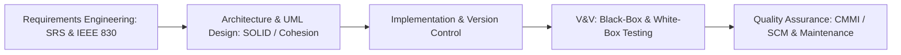

# ⚙️ Software Engineering (CS24353) — Complete Syllabus & Study Guide

> **Academic Program:** B.Tech in Computer Science & Engineering  
> **Scheme:** NEP Scheme (2024–25) | BIT Mesra  
> **Semester:** 5th Semester  
> **Program Elective – I:** `CS24353` — **3.0 Credits**

---

## 📌 Table of Contents
1. [Course Overview & Learning Outcomes](#-course-overview--learning-outcomes)
2. [Theory Syllabus: CS24353 (Modules I – V)](#-theory-syllabus-cs24353)
   - [Module I: Introduction & Software Process Models](#module-i--introduction--software-process-models)
   - [Module II: Software Requirements Engineering](#module-ii--software-requirements-engineering)
   - [Module III: Software Design Engineering & UML Modeling](#module-iii--software-design-engineering--uml-modeling)
   - [Module IV: Verification, Validation & Software Testing](#module-iv--verification-validation--software-testing)
   - [Module V: Project Estimation, Quality Assurance & Maintenance](#module-v--project-estimation-quality-assurance--maintenance)
3. [Standard Reference Books & Recommended Reading](#-recommended-textbooks--references)
4. [Key Exam Topics & High-Yield Questions](#-high-yield-exam-topics--question-bank)
5. [Interactive Study Tracker](#-interactive-study-tracker)

---

## 🎯 Course Overview & Learning Outcomes

Software Engineering provides systematic, disciplined, and quantifiable engineering methodologies for the specification, design, construction, testing, deployment, and maintenance of large-scale, high-reliability software systems.

---

## 📖 Theory Syllabus: CS24353

### Module I – Introduction & Software Process Models
*Focus: Software crisis, software lifecycle models, agile methodologies, and project planning.*

- [ ] **Introduction to Software Engineering:**
  - Definition of Software and Software Engineering (IEEE definition)
  - The Evolving Role of Software and Software Dual Role (Product and Vehicle)
  - The Software Crisis and Software Myths (Management, Customer, Practitioner myths)
  - Software Engineering as a Layered Technology: Tools $\rightarrow$ Methods $\rightarrow$ Process $\rightarrow$ Quality Focus
- [ ] **Software Process Framework & Lifecycle Models:**
  - Generic process framework: Communication, Planning, Modeling, Construction, Deployment
  - **Prescriptive Process Models:**
    - **Classical Waterfall Model:** Linear sequential phases, advantages, feedback loops, limitations
    - **Prototyping Model:** Evolutionary vs. Throwaway prototyping
    - **Incremental Process Model:** Core product delivery and successive increments
    - **RAD (Rapid Application Development) Model:** Component-based construction in time-boxed iterations
    - **Spiral Model (Boehm):** Risk-driven meta-model (Planning, Risk Analysis, Engineering, Evaluation quadrants)
- [ ] **Agile Software Development:**
  - The Agile Manifesto and 12 Agile Principles
  - Agility vs. Traditional Plan-Driven Engineering
  - **Scrum Framework:** Product Backlog, Sprint Planning, Daily Scrum, Sprint Review, Sprint Retrospective, Roles (Product Owner, Scrum Master, Developers)
  - **Extreme Programming (XP):** Pair Programming, Test-Driven Development (TDD), Continuous Integration, Refactoring
  - **Kanban:** Work-in-Progress (WIP) limits, visual workflow boards
- [ ] **Software Project Management Essentials:**
  - The 4 P's: People, Product, Process, Project
  - Project Planning & Scheduling: Work Breakdown Structure (WBS), Gantt Charts, PERT / CPM network diagrams
  - **Risk Management:** Reactive vs. Proactive risk strategies, Risk Identification, Risk Projection (Impact vs. Probability), Risk Mitigation, Monitoring, and Management (RMMM Plan)

---

### Module II – Software Requirements Engineering
*Focus: Functional/non-functional requirements, elicitation techniques, SRS documentation, and requirements management.*

- [ ] **Requirements Engineering Overview:**
  - What is a Requirement? Functional vs. Non-Functional Requirements (Performance, Security, Reliability, Usability, Portability)
  - User Requirements vs. System Requirements
- [ ] **The Requirements Engineering Process:**
  1. **Feasibility Study:** Technical, Operational, Economic, Legal feasibility
  2. **Requirements Elicitation:** Interviews, Surveys, Questionnaires, FAST (Facilitated Application Specification Techniques), JAD (Joint Application Design), Brainstorming, Use case modeling
  3. **Requirements Analysis & Modeling:** Data modeling (ER Diagrams), Functional modeling (Data Flow Diagrams - DFD Level 0, 1, 2), Behavioral modeling (State Transition Diagrams)
  4. **Requirements Specification:** Writing unambiguous requirement statements
  5. **Requirements Validation:** Requirements reviews, Prototyping, Test-case generation
  6. **Requirements Management:** Traceability matrices (Forward & Backward traceability), Change control boards
- [ ] **Software Requirements Specification (SRS) Document:**
  - **IEEE Standard 830-1998** for SRS Structure:
    1. Introduction (Purpose, Scope, Definitions, References, Overview)
    2. Overall Description (Product perspective, Product functions, User characteristics, Constraints, Assumptions)
    3. Specific Requirements (Functional, Performance, Design constraints, External interface requirements)
  - **Characteristics of a Good SRS:** Correct, Unambiguous, Complete, Consistent, Ranked for importance/stability, Verifiable, Modifiable, Traceable

---

### Module III – Software Design Engineering & UML Modeling
*Focus: Architectural design principles, modularity, cohesion/coupling metrics, and Unified Modeling Language.*

- [ ] **Design Concepts & Principles:**
  - Analysis Model to Design Model mapping
  - Fundamental Design Concepts: **Abstraction** (Procedural vs. Data), **Architecture**, **Patterns**, **Modularity**, **Information Hiding** (Parnas principle), **Functional Independence**, **Refinement**, **Refactoring**
  - **SOLID Principles:** Single Responsibility, Open/Closed, Liskov Substitution, Interface Segregation, Dependency Inversion
- [ ] **Modularity & Quality Metrics:**
  - **Cohesion (Internal Module Strength):** Coincidental $<$ Logical $<$ Temporal $<$ Procedural $<$ Communicational $<$ Sequential $<$ **Functional Cohesion** (High Cohesion is desirable)
  - **Coupling (Inter-Module Interdependence):** Content $>$ Common $>$ External $>$ Control $>$ Stamp $>$ **Data Coupling** (Low Coupling is desirable)
- [ ] **Architectural Styles:**
  - Layered Architecture, Client-Server Architecture, Microservices Architecture, Model-View-Controller (MVC), Pipe-and-Filter Architecture
- [ ] **Unified Modeling Language (UML) Diagrams:**
  - Structural vs. Behavioral diagrams
  - **Use Case Diagram:** Actors, Use cases, `<<include>>`, `<<extend>>`, Generalization
  - **Class Diagram:** Classes, Attributes, Methods, Visibility (`+`, `-`, `#`), Associations, Multiplicity, Aggregation (hollow diamond) vs. Composition (filled diamond), Inheritance
  - **Sequence Diagram:** Lifelines, Synchronous/Asynchronous Messages, Activation bars
  - **Activity Diagram:** Action states, Decision nodes, Fork and Join bars, Swimlanes
  - **Statechart / State Machine Diagram:** States, Transitions, Events, Guards, Actions

---

### Module IV – Verification, Validation & Software Testing
*Focus: V&V principles, black-box testing, white-box basis path testing, testing hierarchy, and reliability.*

- [ ] **Verification vs. Validation (Boehm's Definition):**
  - Verification: *"Are we building the product right?"* (Conformity to specification, static analysis)
  - Validation: *"Are we building the right product?"* (Conformity to customer needs, dynamic execution)
  - Formal Technical Reviews (FTR), Walkthroughs, and Software Inspections (Fagan Inspection)
- [ ] **Software Testing Taxonomy:**
  - Failure, Fault (Bug), Error definitions
  - Test Case Design: Preconditions, Inputs, Expected outputs, Postconditions
- [ ] **Black-Box Testing (Functional / Specification-Based Testing):**
  - **Equivalence Class Partitioning (ECP):** Valid vs. Invalid equivalence classes
  - **Boundary Value Analysis (BVA):** Testing boundary points ($\text{min}, \text{min}+, \text{nominal}, \text{max}-, \text{max}$) and extreme boundary analysis
  - **Cause-Effect Graphing & Decision Tables:** Handling complex boolean logic combinations
  - State Transition Testing and Use Case Testing
- [ ] **White-Box Testing (Structural / Code-Based Testing):**
  - Statement Coverage, Branch / Decision Coverage, Condition Coverage, Multiple Condition Coverage
  - **Basis Path Testing (McCabe):**
    - Control Flow Graph (CFG) construction from code
    - **Cyclomatic Complexity ($V(G)$):**
      1. $V(G) = E - N + 2$ (where $E$ = edges, $N$ = nodes)
      2. $V(G) = P + 1$ (where $P$ = predicate / decision nodes)
      3. $V(G) = \text{Number of enclosed regions in planar CFG}$
    - Deriving independent linear basis execution paths
  - Mutation Testing and Data Flow Testing (DU-paths)
- [ ] **Levels of Testing (The V-Model):**
  - **Unit Testing:** Stubs and Drivers, Mocking
  - **Integration Testing:** Big Bang vs. Incremental (Top-Down with stubs, Bottom-Up with drivers, Sandwich testing)
  - **System Testing:** Recovery, Security, Stress, Performance, Load testing
  - **Acceptance Testing:** Alpha testing (developer site) vs. Beta testing (end-user environment)
  - **Regression Testing:** Re-running test suites to verify new changes did not break existing features
- [ ] **Software Reliability Metrics:**
  - Mean Time To Failure (MTTF), Mean Time To Repair (MTTR), Mean Time Between Failures ($\text{MTBF} = \text{MTTF} + \text{MTTR}$)
  - Software Availability: $A = \frac{\text{MTTF}}{\text{MTTF} + \text{MTTR}} \times 100\%$

---

### Module V – Project Estimation, Quality Assurance & Maintenance
*Focus: Estimation metrics, COCOMO models, Function Points, SQA standards, SCM, and maintenance.*

- [ ] **Software Measurement & Metrics:**
  - Size-Oriented Metrics: Lines of Code (LOC), KLOC, Productivity ($\text{KLOC} / \text{PM}$)
  - **Function Point Analysis (Albrecht):**
    - Information Domain Values: External Inputs (EI), External Outputs (EO), External Inquiries (EQ), Internal Logical Files (ILF), External Interface Files (EIF)
    - Unadjusted Function Points ($\text{UFP}$)
    - Value Adjustment Factors (VAF) from 14 General System Characteristics
    - $\text{FP} = \text{UFP} \times [0.65 + 0.01 \times \sum F_i]$
- [ ] **Empirical Estimation Models:**
  - **COCOMO I (Constructive Cost Model - Barry Boehm):**
    - Project Modes: **Organic** (Small, experienced team, well-understood domain), **Semidetached** (Medium team, mixed experience), **Embedded** (Tight hardware constraints, complex mission-critical)
    - Basic COCOMO formulas:
      - $\text{Effort (Person-Months)} = a_b \times (\text{KLOC})^{b_b}$
      - $\text{Development Time (Months)} = c_b \times (\text{Effort})^{d_b}$
      - $\text{Average Staffing} = \frac{\text{Effort}}{\text{Development Time}}$
    - Intermediate & Detailed COCOMO: Effort Multipliers (Cost Drivers)
  - **COCOMO II Overview:** Application Composition, Early Design, Post-Architecture models
- [ ] **Software Quality Assurance (SQA) & Process Improvement:**
  - SQA Plan, SQA Activities, Statistical Software Quality Assurance (Six Sigma)
  - **SEI Capability Maturity Model Integration (CMMI):**
    1. Level 1: Initial (Ad-hoc, chaotic)
    2. Level 2: Managed (Project-level repeatable management)
    3. Level 3: Defined (Organization-wide standardized engineering processes)
    4. Level 4: Quantitatively Managed (Predictable, statistical process control)
    5. Level 5: Optimizing (Continuous process improvement)
  - **ISO 9001:2000** for Software
- [ ] **Software Configuration Management (SCM):**
  - SCM baseline, Configuration Items (SCI), Version control (Git), Change control process, Auditing
- [ ] **Software Maintenance & Evolution:**
  - **Maintenance Categories:** Corrective (Bug fixing, ~20%), Adaptive (Environment changes, ~20%), Perfective (Enhancing features, ~50%), Preventive (Refactoring, ~10%)
  - Lehman's Laws of Software Evolution
  - Software Reverse Engineering, Forward Engineering, and Code Re-engineering

---

## 📚 Recommended Textbooks & References

1. **"Software Engineering: A Practitioner's Approach"**  
   *Roger S. Pressman & Bruce R. Maxim* — McGraw Hill (9th / 8th Edition).  
   *(The definitive industry-standard software engineering textbook).*
2. **"Software Engineering"**  
   *Ian Sommerville* — Pearson (10th Edition).  
   *(Excellent coverage of requirements engineering, architectural styles, and agile processes).*
3. **"Fundamentals of Software Engineering"**  
   *Rajib Mall* — PHI Learning (5th Edition).  
   *(Very concise, exam-focused text for Indian university curricula covering COCOMO and testing).*

---

## 🌟 High-Yield Exam Topics & Question Bank

### Top Numerical & Analytical Problems
1. **Cyclomatic Complexity & Basis Path Testing:** Given a code snippet / algorithm (e.g., finding the maximum of three numbers or binary search), draw the Control Flow Graph (CFG), compute Cyclomatic Complexity $V(G)$ using all three formulas, list all independent linear basis paths, and design test cases for each path.
2. **COCOMO Effort & Duration Estimation:** Given a software project with estimated size $30 \text{ KLOC}$ in Organic and Semidetached modes, calculate the required Effort (Person-Months), Development Time (Months), and Average Staffing using Basic COCOMO parameters.
3. **Function Point Calculation:** Given the counts of EI, EO, EQ, ILF, EIF with complexity weights, and the sum of 14 general system characteristics ($\sum F_i = 42$), calculate the Unadjusted Function Points ($\text{UFP}$) and final Function Points ($\text{FP}$).
4. **Equivalence Partitioning & Boundary Value Analysis:** Given a specification (e.g., input field accepting an integer age between 18 and 60), identify all valid and invalid equivalence classes and determine the minimal set of BVA test cases.
5. **PERT / CPM Scheduling:** Given a list of software project tasks, dependencies, and durations, draw the Activity Network Diagram, determine the Critical Path, and compute the minimum project completion duration.

---

## 📊 Interactive Study Tracker

| Module | Core Concept | Topics Count | Status |
| :---: | :--- | :---: | :---: |
| **M1** | Waterfall, Prototyping, Spiral, Agile (Scrum/XP), Risk Management (RMMM) | 13 | ⬜ Not Started |
| **M2** | Functional vs Non-Functional, IEEE 830 SRS, Feasibility, Elicitation | 12 | ⬜ Not Started |
| **M3** | Modularity, Cohesion (7 types), Coupling (6 types), SOLID, UML Diagrams | 13 | ⬜ Not Started |
| **M4** | V&V, Black-Box (ECP/BVA), White-Box Basis Path ($V(G)$), Testing Levels, Reliability | 16 | ⬜ Not Started |
| **M5** | Function Points, COCOMO I & II, CMMI (5 Levels), SCM, Maintenance (4 Types) | 13 | ⬜ Not Started |

---
*Created for B.Tech 5th Semester CSE — Software Engineering (`CS24353`).*
